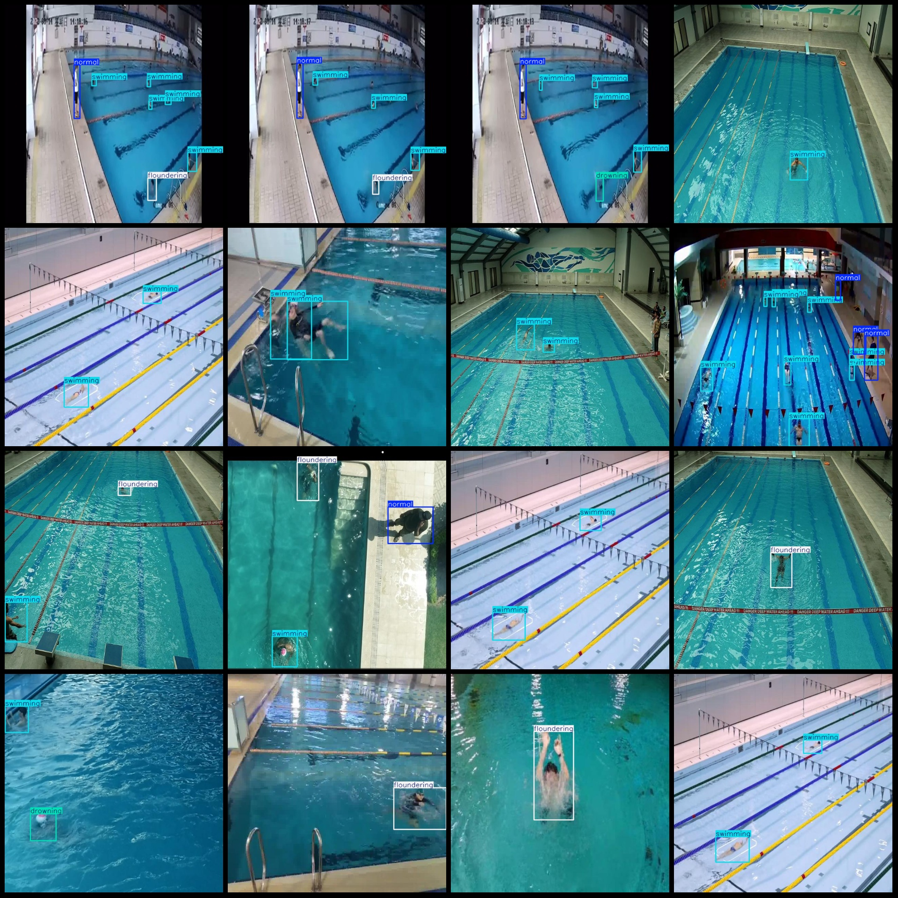
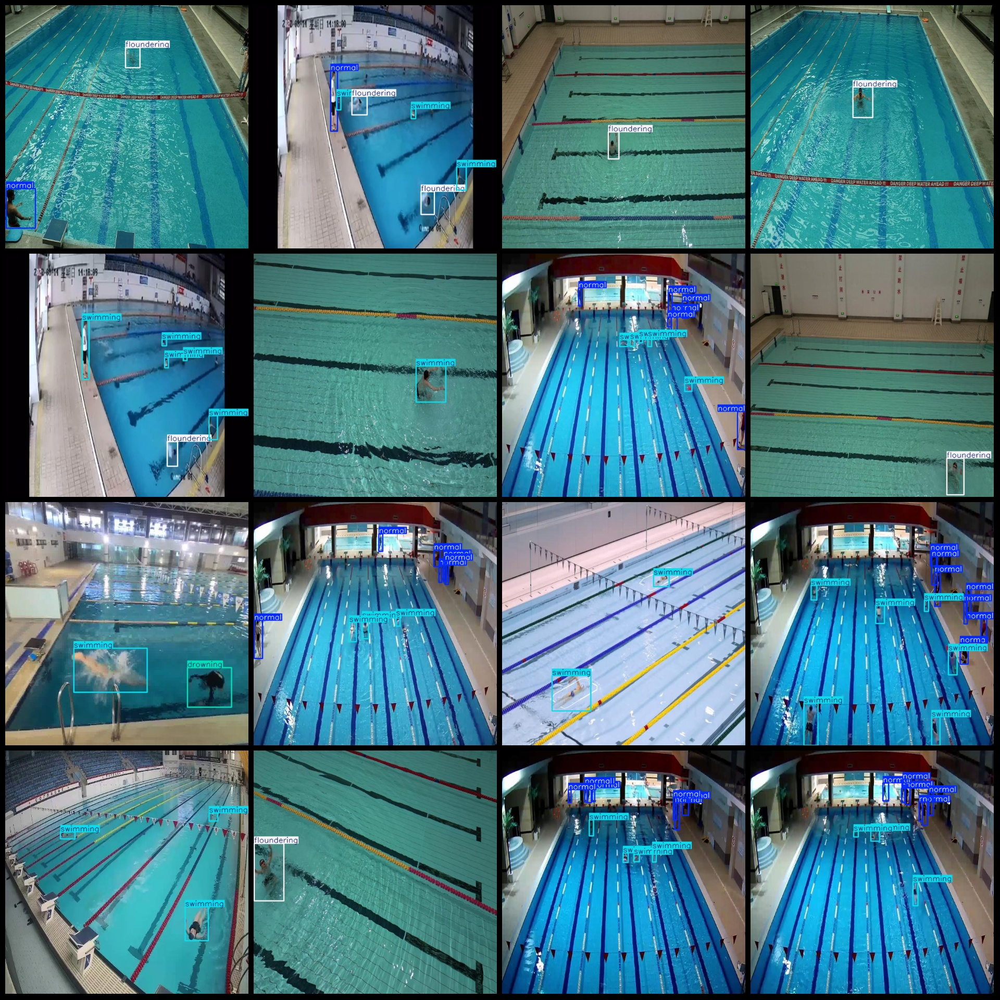

# Pool Detection Dataset for Swimming Pool Drowning

Dataset format: Pascal VOC format + YOLO format (without split path in the txt file, only containing jpg images and corresponding VOC format xml files and yolo format txt files)

Number of images (jpg file count): 3523
Number of annotations (xml file count): 3523
Number of annotations (txt file count): 3523
Number of annotation categories: 4
Annotation category names (Note that the order of categories in the yolo format is not consistent with this, but follows the labels folder classes.txt): ["drowning", "floundering", "normal", "swimming"]
Number of bounding boxes for each category:
drowning (Drowning) = 583
floundering (Floundering) = 1088
normal (Normal activity) = 4915
swimming (Swimming) = 8228
Total bounding box count: 14814
Image resolution: 640x640
Annotation tool used: labelImg
Annotation rule: Draw a rectangle around the category
Important note: No warranty given regarding the accuracy of the trained model or weight files
Image preview:
## Image

Here is a pay link on Stripe ( https://buy.stripe.com/3cs8yP7sY87d0vu9AB ). Please contact me lonlonago@foxmail.com after funding $89, and I will send you a complete data files , thank you!

